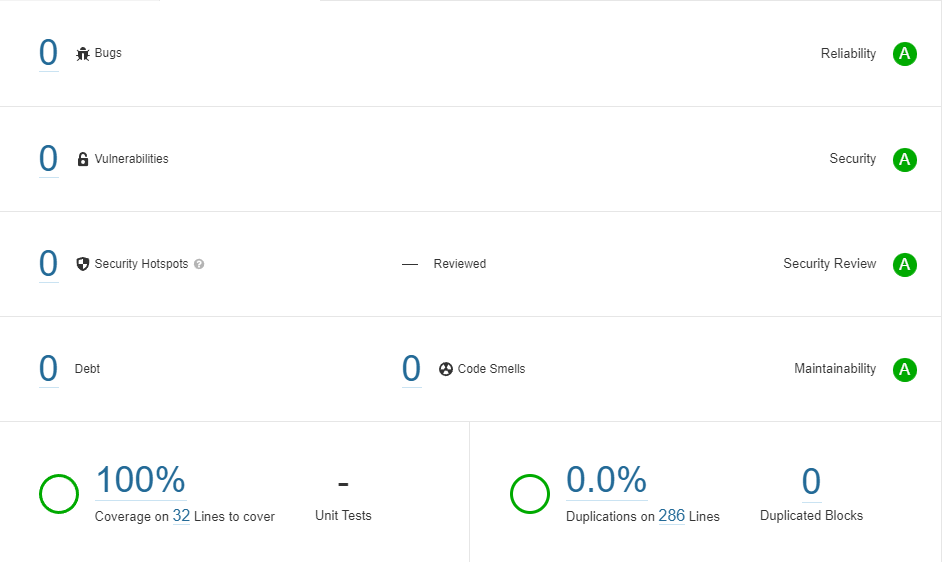

# Thumbnail List


## Description

This is the component which is developed under the Angular 13.0.0 framework to provide the easier and fast creation of the listing with some modification.

## Add Dependencies

`npm install ng-bootstrap@8.0`

`npm install bootstrap@5.1`

`npm install lodash`

## Configuration

Import the component in the `app.module.ts` file to use it.

Copy the [list-one](https://github.com/Deep1218/reusable/tree/thumbnail-list/src/app) folder to your project.

```
import { NgModule } from '@angular/core';
import { BrowserModule } from '@angular/platform-browser';

...
import { ListOneComponent } from './components/list-one/list-one.component';
...

@NgModule({
    ...
    declarations: [
        ...
        ListOneComponent,
        ...
    ],
    ...
})
export class AppModule {}
```

## How to Use Component

After importing use its selector tag to use it as shown below.

src/app.component.html

```
<div class="row" *ngFor="let item of data">
  <app-list-one
    [data]="item"
    [border]="true"
    position="start"
    imgShape="normal"
  ></app-list-one>
</div>
```

src/app.component.ts

```
data: ListData[] = [...]
```

### Properties:-

| Property     | Values                                  | Description                                                                                 |
| ------------ | --------------------------------------- | ------------------------------------------------------------------------------------------- |
| `[data]`     | Object with the interface of `listData` | Display the items in the list.                                                              |
| `[border]`   | `true` or `false`                       | Default `true`, Show border of the item in the list if true else `<hr/>` tag at the bottom. |
| `[position]` | `start` or `end`                        | Default `start`, Display the image at the beginning of the item else at the `end`.          |
| `[imgShape]` | `normal`, `rounded` or `circle`         | Default `rounded`, It will set the border style of the image.                               |

### Interface:-

This interface is used `@Input() data` in the component.

```
interface ListData {
  id: number;
  imgUrl?: string;
  title?: string;
  name?: string;
  line1?: string;
  line2?: string;
}

```

## Unit Testing Result:-


