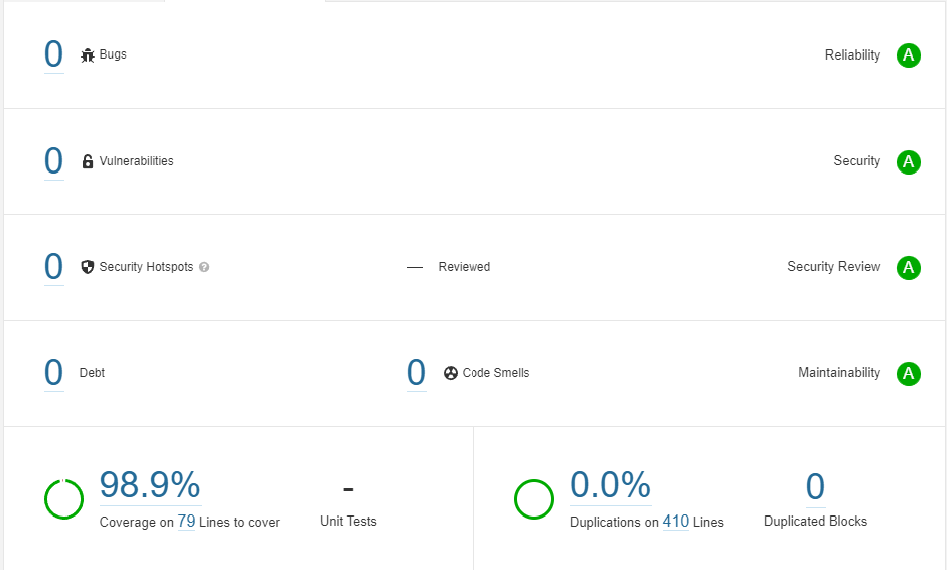

# Sign Up Form With Recaptcha


## Description

This is the service which is developed under the Angular 13.0.0 framework to provide the easier and fast creation of the form with some predefine fields form which which you can choose.

## Configuration

```
import { AppRoutingModule } from './app-routing.module';
import { AppComponent } from './app.component';
import { ReactiveFormsModule } from '@angular/forms';
import { NgbModule } from '@ng-bootstrap/ng-bootstrap';

@NgModule({
  declarations: [AppComponent],
  imports: [
    BrowserModule,
    AppRoutingModule,
    ReactiveFormsModule,
    NgbModule
  ],
  providers: [],
  bootstrap: [AppComponent],
})
export class AppModule {}
```

import the following modules in the `app.module.ts` file to use this service.

Copy and Past the below 2 file to your project [here](https://github.com/Deep1218/reusable/tree/login-with-recaptcha/src/app/service).

1. forms.service.ts
2. forms.service.spec.ts (optional)

## How to Use Forms Service

After pasting the above 2 files to your project import the service in your component same as importing other services.

```
import { Component } from '@angular/core';
import { FormGroup } from '@angular/forms';
import { FormsService } from './service/forms.service';

@Component({
  selector: 'app-root',
  templateUrl: './app.component.html',
})
export class AppComponent {
  cardForm!: FormGroup;
  formData: any;

  constructor(private formService: FormsService) {
    this.cardForm = this.formService.createCardForm();
  }

  onSubmit() {
    console.log(this.cardForm.value);
    this.formData = this.cardForm.value;
  }
}
```

## Forms Service

This service will return form group with selected form control.

### Methods:-

| Field Options       | Description                                                                                       |
| ------------------- | ------------------------------------------------------------------------------------------------- |
| `createCardForm();` | Will return the form group with cardNumber, expiryDate, cvvCode and cardHolderName form controls. |

## Validation Regex Used:-

**Form control Name:** `cardNumber`

**Regex:** `([0-9]{4}[-. ]?){4}|[0-9]{4}[-. ]?[0-9]{6}[-. ]?[0-9]{5}`

**Description:**

- Max 16 character if only numbers.
- Max 19 character if use '-', '.' or ' '.

**Form control Name:** `cvvCode`

**Regex:** `^[0-9]{3,4}$`

**Description:**

- Only number from 0 to 9 and lenght 3 or 4.

**Form control Name:** `cardHolderName`

**Regex:** `^[A-za-z ]*$`

**Description:**

- Characters containing on alphabet and space.

## Unit Testing Result:-


