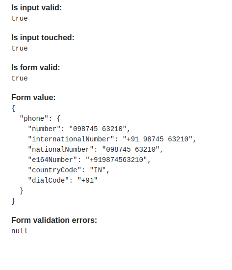

# Phone No Selector.


# Project Prerequisite

1. Angular CLI v13.0.0
2. Node.js v16.16.0

# Adding Component to your project
1. It [folder](https://github.com/Deep1218/reusable/tree/phoneno-selector/src/app) to your project.
2. 1mport the component in the `app.module.ts` file to use it.


## Add Dependencies
    It is install the pakeage for the  Animations for the Country  
 `$ npm install intl-tel-input@17.0.3 --save`

 `$ npm install google-libphonenumber --save`

 `$ ng add ngx-bootstrap`

## Add Dependency Style
`./node_modules/intl-tel-input/build/css/intlTelInput.css`

**angular.json styles :**
```
"styles": [
  "./node_modules/intl-tel-input/build/css/intlTelInput.css",
  "src/styles.css"
],
```
## Install This Library

`$ npm install ngx-intl-tel-input --save`

## How to use validation Form and phone no details
```
  <div>
    <strong>Is input valid:</strong>
    <pre>{{ !f.form.controls['phone'].invalid }}</pre>
  </div>
  <div>
    <strong>Is input touched:</strong>
    <pre>{{ f.form.controls['phone'].touched }}</pre>
  </div>
  <div>
    <strong>Is form valid:</strong>
    <pre>{{ f.form.valid }}</pre>
  </div>
  <div>
    <strong>Form value:</strong>
    <pre>{{ f.form.value | json }}</pre>
  </div>
  <div>
    <strong>Form validation errors:</strong>
    <pre>{{ f.form.controls['phone'].errors | json }}</pre>
  </div>
  ```
**result:**


